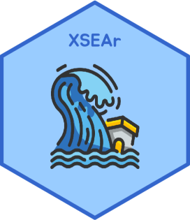

# XSEAr
XSEAr is a collection of R scripts for frequency analysis of extreme values with examples from extreme sea events. These scripts are being developed as part of my ongoing Ph.D. research on coastal flood hazard and sea-level extremes, mainly for educational purposes. The codes published in this repository are generally applicable to extreme value analysis of any other variable(s) of interest, not necessarily restricted to extreme water levels. 

